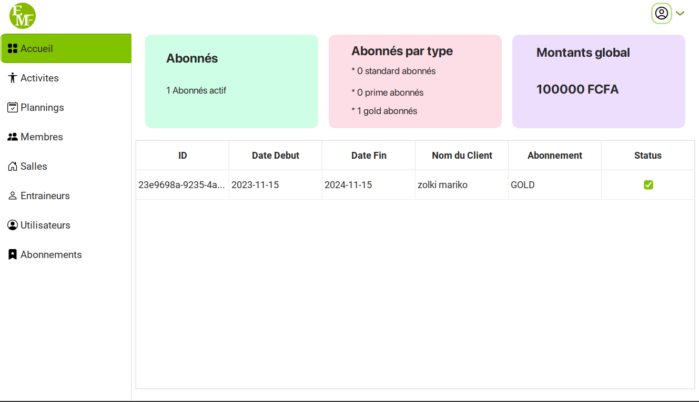
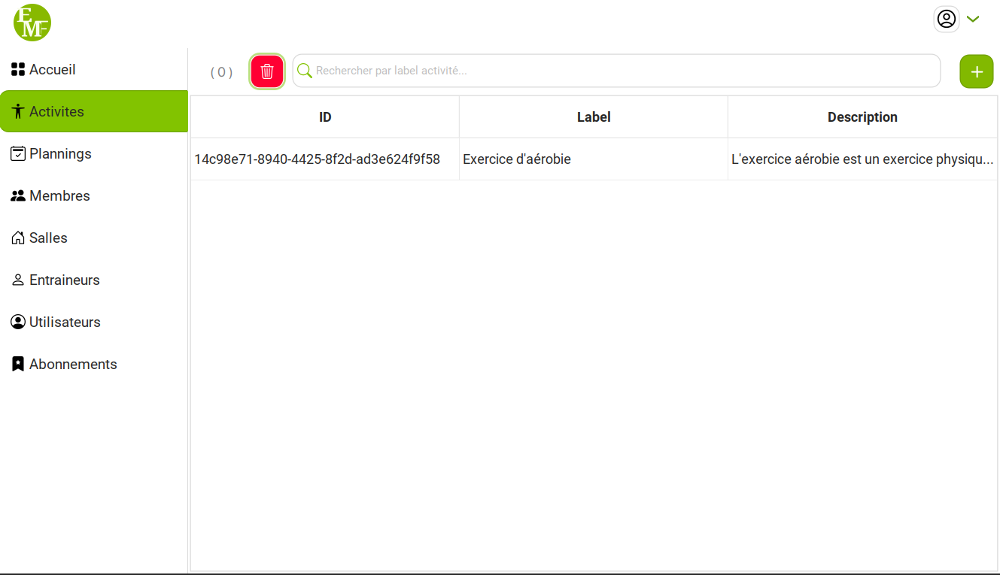
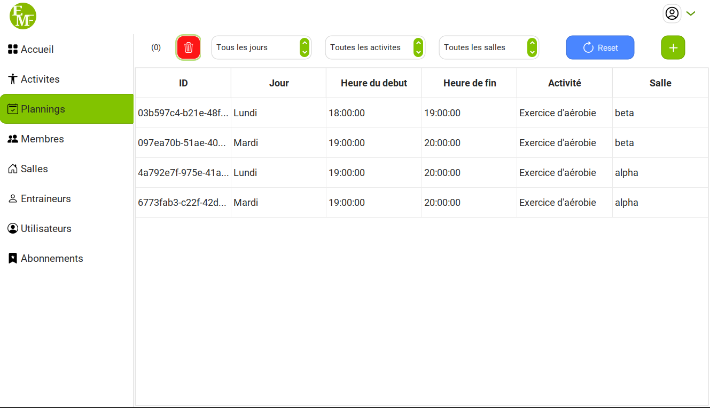
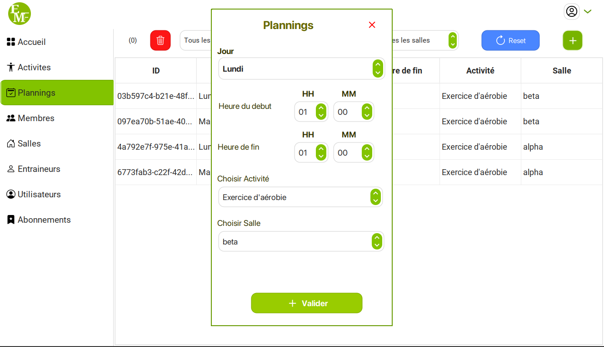
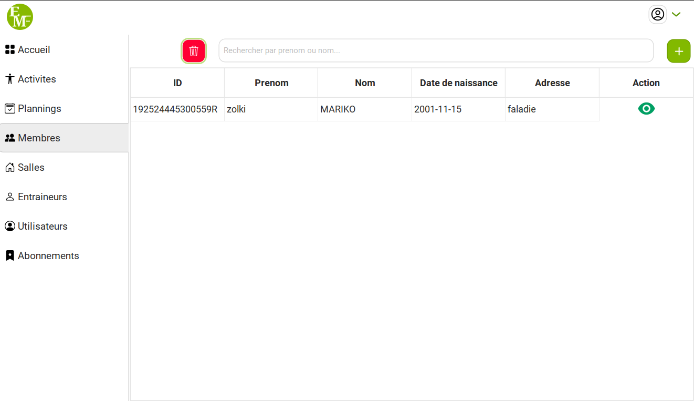
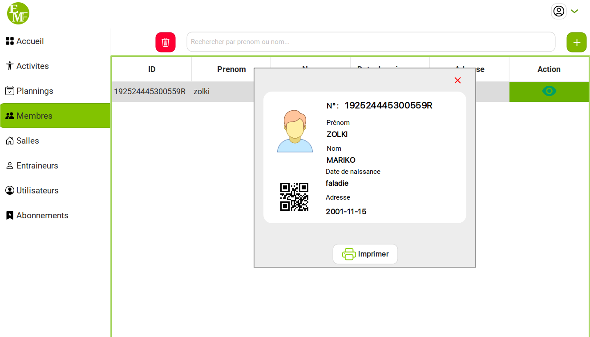
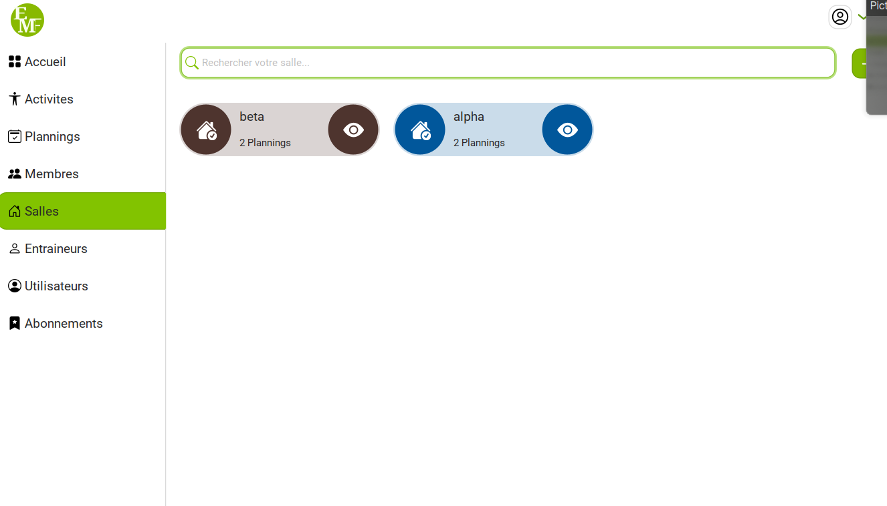

<h1 style="text-align:center">MaiEMFitness APP</h1>
<h2>Login page</h2>

<h2>Dashboard Admin</h2>

<h2>Activities Admin</h2>

<h2>Plannings Admin</h2>

<h2>Added Planning Admin</h2>

<h2>Customers Admin</h2>

<h2>Customers Details Admin</h2>

<h2>Gym Admin</h2>

